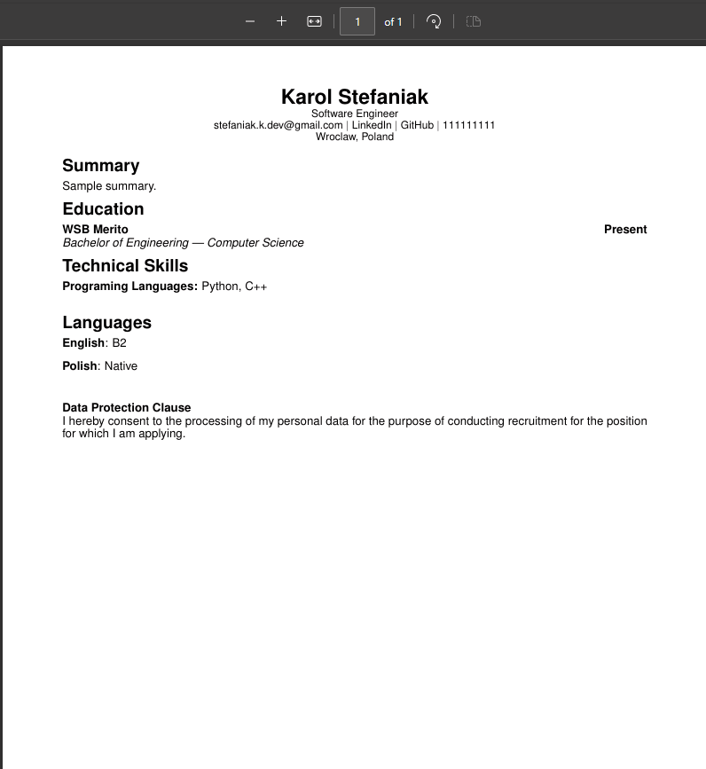

# Projekt: CV_Maker - Generator CV


## O Projekcie

Projekt CV_Maker, to aplikacja webowa stworzona, aby uprościć proces tworzenia profesjonalnych plików CV w formacie PDF. Główną motywacją było stworzenie narzędzia, które pozwoli każdemu szybko wygenerować estetyczny i dobrze sformatowany dokument PDF na podstawie mojego szablonu LATEX, bez potrzeby znajomości programów do składu tekstu czy płatności za generatory CV.

Aplikacja składa się z backendu napisanego w Pythonie z użyciem lekkiego frameworka Flask oraz prostego, ale funkcjonalnego frontendu w czystym HTML, CSS i JavaScript. Całość znajduje się w kontenerach Docker, co sprawia, że uruchomienie projektu na dowolnej maszynie jest banalnie proste. I aplikacja jest od razu gotowa do użycia.

## Spełnienie Wymagań Projektowych

Poniżej szczegółowo opisałem, w jaki sposób mój kod realizuje wszystkie punkty z listy wymagań kursu, podając konkretne przykłady z plików projektu.

### Podstawy Programowania Obiektowego

* **Użycie klas i dziedziczenia:** Rdzeniem mojej aplikacji jest folder cv_maker, który zawiera moduły z klasami. W pliku `backend/cv_maker/models/section.py` zdefiniowałem klasę bazową `Section`. Po niej dziedziczą bardziej szczegółowe klasy jak `PersonalInfoSection`, `ExperienceSection`, `EducationSection` czy `SkillsSection`, które reprezentują konkretne części CV dostosowane do standardów ATS.

* **Atrybuty i ich nadpisywanie:** Każda klasa dziedzicząca po `Section` w swoim konstruktorze (`__init__`) definiuje własną, specyficzną dla siebie wartość atrybutu `title`. Na przykład klasa `ExperienceSection` ustawia `title="Experience"`, a klasa `EducationSection` ustawia `title="Education"`.

* **Metody i ich nadpisywanie:** Doskonałym przykładem nadpisywania metod w moim projekcie jest implementacja metody `__repr__()`. W klasie bazowej `Section` `section.py` metoda ta zwraca ogólną, tekstową reprezentację obiektu, np. `Section(title='Experience', entries=3)`. Jednak niemal każda klasa, która po niej dziedziczy (np. `SummarySection` czy `ExperienceSection`), dostarcza własną, bardziej szczegółową implementację `__repr__()`, dostosowaną do swojej specyfiki. Dzięki temu, wywołując `print()` na obiekcie `ExperienceSection`, otrzymuję czytelniejszą informację, np. `ExperienceSection(title='Experience', entries_count=3)`, co jest klasycznym przykładem polimorficznego zachowania i nadpisywania metod.

* **Dekoratory `@classmethod` i `@staticmethod`:**
    * **`@classmethod`**: W pliku `backend/cv_maker/models/cv.py`, klasa `CV` posiada metodę `from_dict` ozdobioną tym dekoratorem. Pełni ona rolę alternatywnego konstruktora, tworząc obiekt `CV` na podstawie struktury słownikowej.
    * **`@staticmethod`**: W pliku `backend/cv_maker/services/section_factory.py`, metoda `create_section` w klasie `SectionFactory` jest statyczna. Nie wymaga ona dostępu do instancji klasy (`self`), a jej jedynym zadaniem jest stworzenie i zwrócenie obiektu odpowiedniej sekcji.

* **Klasa z więcej niż jednym konstruktorem:** Klasa `CV` jest idealnym przykładem. Posiada standardowy konstruktor `__init__` oraz wspomniany wyżej "fabryczny" konstruktor `from_dict()`, oznaczony jako `@classmethod`, który umożliwa konstrukcję obiektu za pomocą słownika.

* **Enkapsulacja:** Zamiast pozwalać na bezpośrednią manipulację wewnętrznymi listami (jak `self.sections` w klasie `CV`), dostęp do nich jest kontrolowany przez publiczne metody, takie jak `add_section` (`cv.py`) czy `add_entry` (`section.py`). Stanowi to formę enkapsulacji, gdzie obiekt sam zarządza swoim stanem wewnętrznym.

* **Polimorfizm:** W klasie `CV` (plik `backend/cv_maker/models/cv.py`) atrybut `self.sections` jest listą, która przechowuje obiekty różnych typów (np. obiekty `ExperienceSection` i `SkillsSection` w tej samej liście). Metoda `add_section` tej klasy może przyjąć dowolny obiekt, o ile dziedziczy on po `Section`, co jest praktycznym przykładem polimorfizmu.

* **Użycie implementacji z klasy rodzica: super():** Aby uniknąć powielania kodu w konstruktorach (`__init__`) klas dziedziczących, każda z nich (np. `ExperienceSection` w pliku `backend/cv_maker/models/section.py`) wywołuje konstruktor klasy nadrzędnej za pomocą `super().__init__(title)`. Dzięki temu wspólna logika inicjalizacji jest zawarta w jednym miejscu, w klasie bazowej `Section`, co czyni kod czystszym i łatwiejszym w utrzymaniu.

* **Własna klasa wyjątku:** W pliku `backend/cv_maker/cv_exceptions.py` zaimplementowałem hierarchię własnych klas wyjątków. Klasa bazowa `CVException` dziedziczy po wbudowanym `Exception` i stanowi podstawę dla bardziej wyspecjalizowanych błędów, takich jak `ValidationError` czy `SectionError`. Praktyczne zastosowanie tego widać w "fabryce" sekcji (`section_factory.py`). Gdy fabryka otrzyma polecenie stworzenia nieznanego typu sekcji, rzuca wyjątkiem `raise SectionError()`.

### Zastosowane Wzorce Projektowe

Wykorzystałem trzy wzorce projektowe, aby kod był bardziej elastyczny, czytelny, zrozumiały i łatwiejszy w rozbudowie:

1.  **Wzorzec Strategii (Strategy):** W pliku `backend/cv_maker/services/strategy_pdf.py` zdefiniowałem interfejs `OutputStrategy` oraz jego konkretną implementację `LaTeXStrategy`. Pozwala to na oddzielenie logiki generowania CV od reszty aplikacji. W przyszłości można by łatwo dodać nową strategię, np. `HTMLStrategy`, bez modyfikacji istniejącego kodu.

2.  **Wzorzec Fabryki (Factory):** W pliku `backend/cv_maker/services/section_factory.py` znajduje się klasa `SectionFactory`. Jej metoda `create_section` odpowiada za tworzenie obiektów konkretnych sekcji. Dzięki temu główna logika aplikacji nie musi wiedzieć, jak tworzyć każdy typ sekcji - zleca to fabryce.

3.  **Wzorzec Budowniczego (Builder):** Zaimplementowany w pliku `backend/cv_maker/services/builder_cv.py` jako klasa `CVBuilder`. Wzorzec ten pozwala na tworzenie różnych, wyspecjalizowanych wariantów obiektu `CV`. Użytkownik może na przykład usunąć z CV konkretną sekcję za pomocą metody `remove_section`, dostosowując dokument do swoich potrzeb.

## Zastosowane Technologie Dodatkowe

Poza spełnieniem minimalnych wymagań kursu, projekt wykorzystuje też inne technologie:

* **Backend:** Flask
* **Konteneryzacja:** Docker
* **Serwer WWW:** Nginx
* **Frontend:** HTML, CSS, JavaScript

## Jak uruchomić projekt?

1.  Upewnij się, że masz zainstalowany Docker.
2.  W głównym folderze projektu uruchom polecenie w terminalu:
    ```
    docker-compose up --build
    ```
3.  Aplikacja będzie dostępna w przeglądarce pod adresem `http://localhost:8080`.

## Jak korzystać z aplikacji?

1. Wypełniamy wszystkie sekcje, które powinny znajdować się na naszym CV.
2. Uruchamiamy Generate CV i w pobranych plikach otrzymamy gotowe CV.

## Przykładowy input.


## Przykładowy output.


## Koncepcja Projektu

Aplikacja została zaprojektowana z myślą o przyszłej rozbudowie, a jej pierwotna koncepcja zakładała stworzenie zaawansowanego systemu do zarządzania życiorysami.

**Początkowa koncepcja projektu:**
1.  **Główne CV i Baza Danych:** Użytkownik tworzyłby jedno, kompletne "CV-matkę", które zawierałoby wszystkie jego doświadczenia, umiejętności i projekty. Dane te miały być przechowywane w lokalnej bazie danych, co wyjaśnia obecność atrybutów `id` w klasach modeli – zostały one przygotowane z myślą działaniu na relacjach w bazach danych.
2.  **Dedykowane CV generowane przez AI:** Kluczową funkcjonalnością miało być automatyczne tworzenie dedykowanych wersji CV pod konkretne oferty pracy. W tym celu zaprojektowana została klasa `DedicatedCV`. Proces miał polegać na podaniu linku do ogłoszenia, który następnie byłby analizowany przez model językowy (planowo z repozytorium Hugging Face). Model miał za zadanie porównać wymagania z profilem użytkownika, a następnie wygenerować CV, wybierając kluczowe kompetencje i ukrywając te mniej istotne dla danej rekrutacji, aby CV nie było zapchane zbędnymi informacjami.

Z uwagi na ograniczenia czasowe, nie wyrobiłem się z implementacją AI oraz integracja z bazą danych. Niemniej, obecna wersja aplikacji jest w pełni funkcjonalna i w 100% realizuje swoje kluczowe zadanie: generowanie profesjonalnego CV w formacie PDF na podstawie danych wprowadzonych przez użytkownika.